#开篇简介

这个项目是模仿[nano-vllm](https://github.com/GeeeekExplorer/nano-vllm)，基于[Llama-3.2-3B-Instruct](https://huggingface.co/meta-llama/Llama-3.2-3B-Instruct)实现的LLM项目，主要是为了学习为目的，所以进行了以下三点更改：

1. 通过pytorch实现flash_attn_varlen_func, flash_attn_with_kvcache两个函数，便于理解attention的运算本质。当然也以通过安装flash_attn来运行，后面会有
2. 重新实现简单版的store_kvcache，便于理解。
3. 基于作者本人的理解，增加了大量注释，为不是机器学习科班出生的工程师了解LLM项目降低难度。


#运行环境

[WSL version2 + Ubuntu 24.04](https://learn.microsoft.com/en-us/windows/wsl/install) + RTX 3090 Ti (24GB) + Pytorch[2.10.0+cu128] , 如果你的显存少于12G，也可以用[Llama-3.2-1B-Instruct](https://huggingface.co/meta-llama/Llama-3.2-1B-Instruct)来跑，只是没那么智能，对于项目的理解没有任何障碍。

直接在裸机上安装Linux应该也是能运行的，只是安装NVIDIA的驱动稍微麻烦点，所以我没有试。

在Windows + WSL v2上，只要在Windows上安装最新的Nvidia驱动，WSL里的Linux就会自动通过GPU的半虚拟化技术直接使用Windows的NVIDIA驱动，而不需要单独为WSL里的Linux安装驱动，如下2图所示：

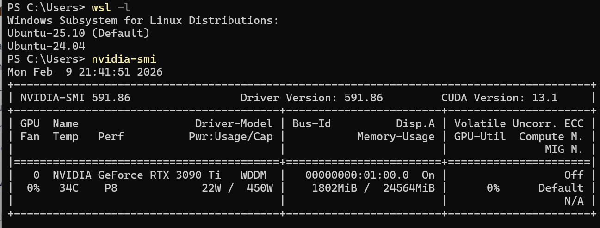

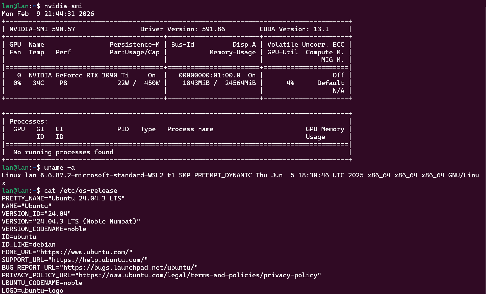

#安装软件

系统环境设置好之后，需要安装必要的软件：

```
sudo apt update
sudo apt install git build-essential python3.12-venv python3-dev

```

安装完成后，创建一个文件夹，准备下载Llama模型。

```
mkdir mini-llama
cd mini-llama
python3 -m venv .venv
source .venv/bin/activate
pip3 install -U "huggingface_hub[cli]"
```
如下图所示：
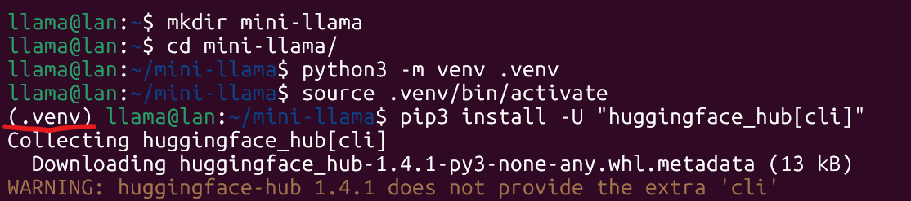

有了huggingface的cli之后，去huggingface注册，申请[token](https://huggingface.co/settings/tokens),拿到token后，用hf登录：

```
hf auth login --token YOUR_TOKEN_FROM_HF
```
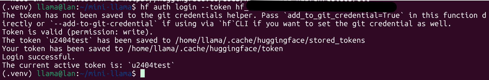

到这一步，就可clone代码了。同时去huggingface.co里申请一下[Llama模型的使用协议](https://huggingface.co/meta-llama/Llama-3.2-3B-Instruct/tree/main)。 最后执行llama3-2_3B.sh下载模型。
```
git clone https://github.com/lanrobin/mini-llama.git

./mini-llama/llama3-2_3B.sh

```

下载完成后，应该是这样的目录结构：

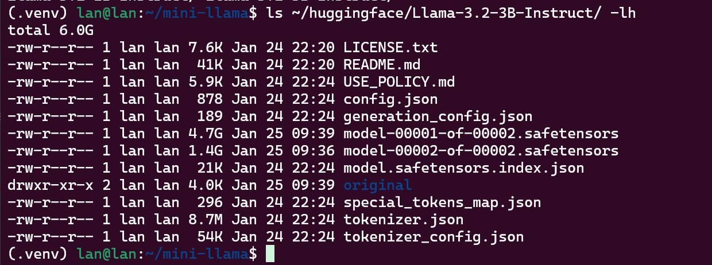

最后再安装必要的python软件包就可以运行了。

```
pip3 install -r mini-llama/requirements.txt

python3 mini-llama/mini-llama.py
```
开始运行：
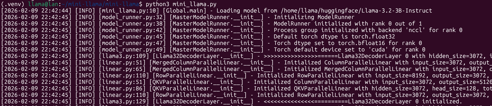
经过一段时间和打一大堆日志后，运行出结果：
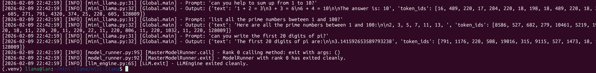

＃ 配置VSCode浏览代码

1. 在Windows里安装VSCode之后，安装WSL, Python插件，在左下角的 ><解析选择打开 "Open a Remote Window".
2. 选择你的WSL。
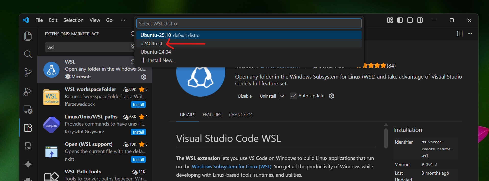
3. 打开你的clone代码的目录 ~/mini-llama，选择打开mini_llama.py文件。然后从菜单选择 "Run" -> "Add Configuration ..." 把下面的代码贴到launch.json里:
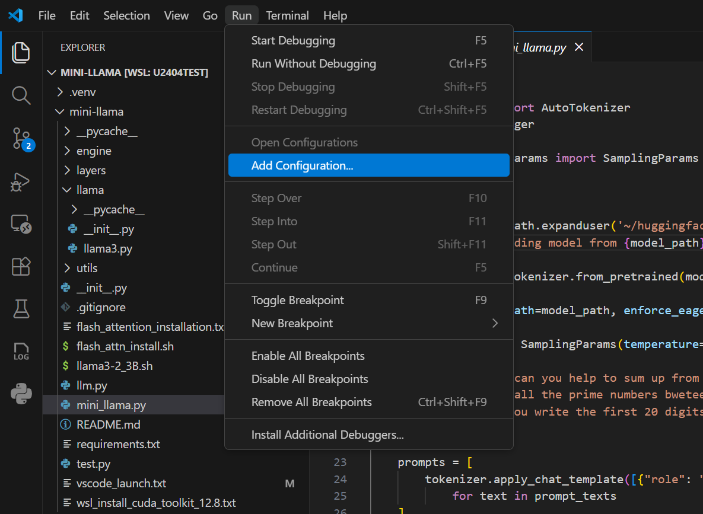
```
{
    // Use IntelliSense to learn about possible attributes.
    // Hover to view descriptions of existing attributes.
    // For more information, visit: https://go.microsoft.com/fwlink/?linkid=830387
    "version": "0.2.0",
    "configurations": [
        {
            "name": "Python Debugger: Current File",
            "type": "debugpy",
            "request": "launch",
            "cwd": "${workspaceFolder}",
            "program": "${workspaceFolder}/mini-llama/mini_llama.py",
            //"program": "${workspaceFolder}/mini-llama/test.py",
            "console": "integratedTerminal",
            "env": {
                "CUDA_LAUNCH_BLOCKING": "1", //Optional: Enable CUDA's synchronous error checking | 可选：启用CUDA的同步错误检查
                "TORCH_USE_CUDA_DSA": "1"  // Optional: Enable Device-side Assertions | 可选：如果要启用设备端断言（Device-side Assertions）
            }
        }
    ]
}
```
4. 保存，在mini_llama.py中左侧边栏打一个断点，从菜单选择 “RUN” -> "Start Debugging" 或者直接按F5。
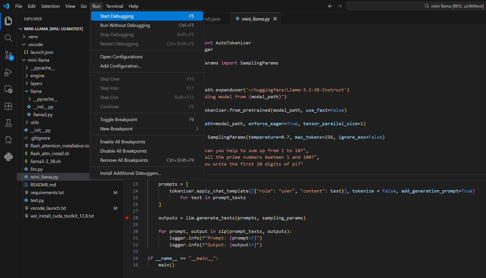
5. 代码跑一会就停在断点上了，然后就可以单步调试了。
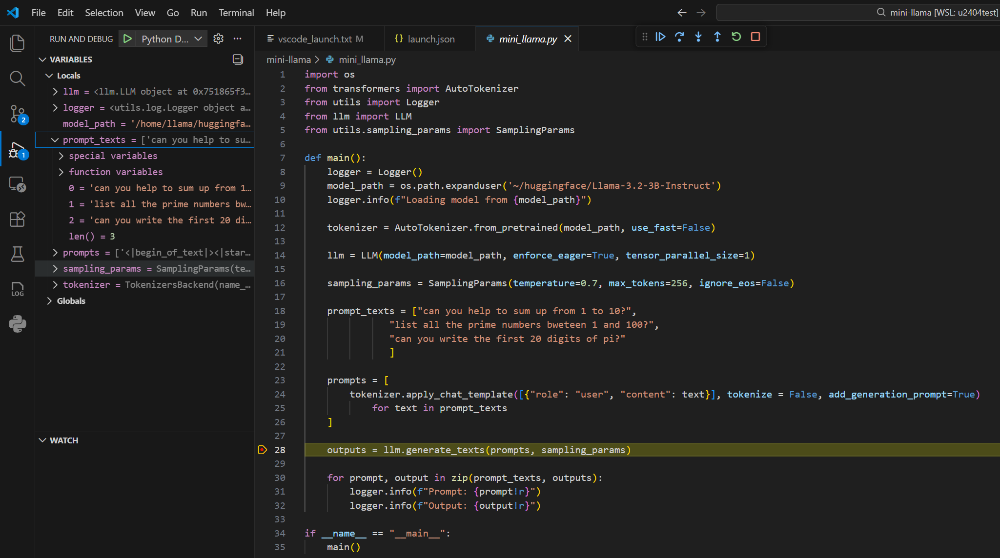

＃ 使用flash-attn

1. 先安装cuda toolkit 12.8.
```
# 1. 下载 NVIDIA 仓库的 Pin 文件（配置优先级）
wget https://developer.download.nvidia.com/compute/cuda/repos/wsl-ubuntu/x86_64/cuda-wsl-ubuntu.pin
sudo mv cuda-wsl-ubuntu.pin /etc/apt/preferences.d/cuda-repository-pin-600

# 2. 下载 CUDA 12.8 的 WSL 专用安装包 (约 3GB)
wget https://developer.download.nvidia.com/compute/cuda/12.8.0/local_installers/cuda-repo-wsl-ubuntu-12-8-local_12.8.0-1_amd64.deb

# 3. 安装仓库包
sudo dpkg -i cuda-repo-wsl-ubuntu-12-8-local_12.8.0-1_amd64.deb

# 4. 复制 Keyring (这是新版安装包的关键步骤，不配会报错)
sudo cp /var/cuda-repo-wsl-ubuntu-12-8-local/cuda-*-keyring.gpg /usr/share/keyrings/

# 5. 更新 apt 缓存
sudo apt-get update

# 6. 【关键】只安装 Toolkit，不安装驱动
# 注意：千万不要用 "sudo apt-get install cuda"，那会试图安装驱动！
sudo apt-get -y install cuda-toolkit-12-8
```

2. 安装完成cuda toolkit 12.8之后，就是要安装flash-attn了。这个时间比较久，
```
# 只为 RTX 30 系列 (Ampere) 编译
# 计算能力列表可以参考 NVIDIA 官方文档：https://developer.nvidia.com/cuda-gpus
#export TORCH_CUDA_ARCH_LIST="8.6"
export CUDA_HOME=/usr/local/cuda-12.8

# RTX 50 系列 (Ada) 编译
export TORCH_CUDA_ARCH_LIST="12.0"

# 限制并发进程数以防爆内存
# 这个数据可以根据你的系统内存和 CPU 核心数进行调整。
# 32GB 内存的系统建议设置为 4-6，64GB 内存的系统可以设置为 8-12。
export MAX_JOBS=8

# 开始安装
pip3 install flash-attn --no-build-isolation --no-cache-dir --force-reinstall --ignore-installed
```
如果在安装过程中出现下面的错误，请卸载不对的pytorch版本。
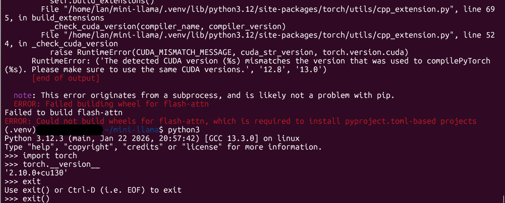

```
pip3 uninstall torch torchvision torchaudio

pip3 install -r mini-llama/requirements.txt

python3 -c "import torch; print(torch.__version__)"

2.10.0+cu128
```
然后再跑安装flash-attn的脚本。这需要比较长的时间，取决你的机器的配置，等着看到flash_attn安装成功的信息：
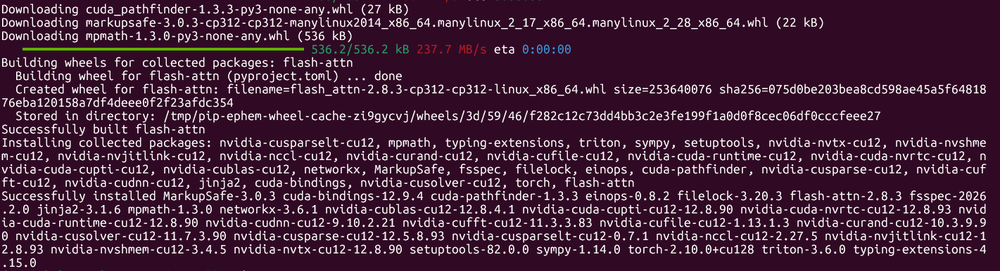
然后到layeres/attention.py 把flash_attn_mock注释掉，再运行就是用的flash attention了。
```
# 原始高性能实现（需要安装 flash-attn）:
from flash_attn import flash_attn_varlen_func, flash_attn_with_kvcache

# 纯 PyTorch 实现，便于理解逻辑:
#from layers.flash_attn_mock import flash_attn_varlen_func, flash_attn_with_kvcache
```